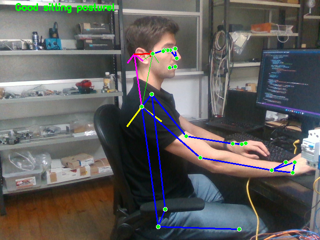
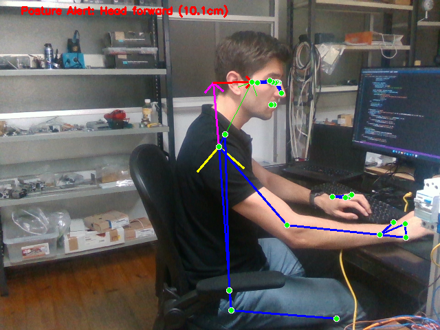
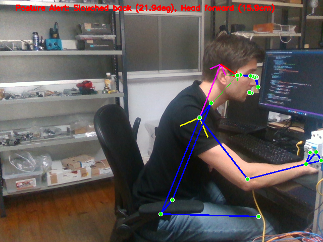
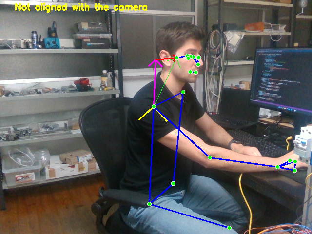
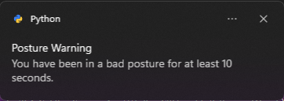

# Posture Police

**Posture Police** is a real-time posture monitoring application using a Framos RealSense depth camera and MediaPipe Pose. It helps you maintain a healthy sitting posture by analyzing your body alignment and notifies you if you remain in a bad position for too long.

## Why Real-World Units Matter

Relying on pixel distances for posture detection is unreliable because user position and camera setup may change. By using real-world centimeters (from depth data), the application delivers consistent and meaningful feedback regardless of where you sit.

## Why Use a Side (Profile) View?

The best camera placement for posture analysis depends on what you want to measure. Here’s a comparison of common options:

| Camera Placement | Best For                        | Typical Features                 |
|------------------|---------------------------------|----------------------------------|
| **Side (Profile)** | Posture, head projection, back  | Head projection, back angle     |
| **Front**        | Symmetry, face, engagement      | Shoulder/hip alignment           |

I prefer the side (profile) view because I prioritize monitoring neck projection (forward head posture), which is best captured from this angle.

## Features

- Real-time pose detection with Intel RealSense and MediaPipe
- Combines RGB and Depth data; depth camera provides true measurements in centimeters
- Monitors key landmarks: shoulders, hips, and ear
- Detects slouched back, forward head posture, and camera misalignment
- Sends a Windows desktop notification if poor posture is maintained for 10 seconds

## Images

  
   
  <em>Fig. 1 - Good Posture</em>

  
  
   
  <em>Fig. 2 - Bad Postures</em>

  
   
  <em>Fig. 3 - Not Aligned</em>

  
   
    <em>Fig. 4 - Warning Notification</em>

## Requirements

- Python 3.11
- FRAMOS RealSense depth camera (e.g., D415e, D435e, D455e)
- Windows OS (for notifications; can be adapted for other platforms)
- Python packages:
  - `pyrealsense2`
  - `opencv-python`
  - `mediapipe`
  - `numpy`
  - `win10toast` (for Windows notifications)

## Usage

1. Run the script.
2. The application window will open and begin monitoring your posture.
3. If you remain in a bad posture ("slouched back," "head forward," or misaligned) for at least 10 seconds, a Windows notification will appear.
4. Press `q` or `ESC` to quit.

## Customization

- Adjust posture detection thresholds in the script to suit your needs.
- Adjust if you want to use the camera in the left side
- Notification duration and alert logic can be modified as required.
